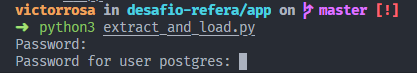
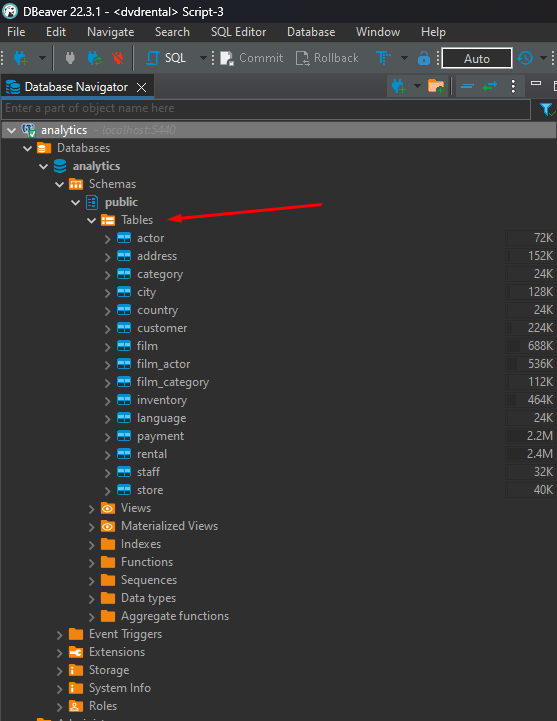

## O desafio Proposto

Pensando em não sobrecarregar nosso banco de dados transacional, precisamos ter um ambiente separado para analisar nossos dados sem grandes problemas. Assim, escreva um código local que faça uma extração total de todas as tabelas do banco de dados `transactional` e as carregue para o banco de dados `analytics`.

O arquivo [docker-compose.yml](docker-compose.yml) ativa containers com os bancos de dados `transactional` e `analytics`.


Diferenciais na implementação:
- script rodando dentro do docker

## Configuração do Ambiente

Os banco de dados podem ser configurados usando o docker compose. Você pode instalá-lo seguindo as instruções em https://docs.docker.com/compose/install/.

Clone o repositório:


```bash
git clone https://github.com/Victor-Rosa/desafio-refera.git
```

Com o docker compose instalado, basta executar:

```bash
cd desafio-refera
docker-compose up
```

Logo depois para rodar o script de cópia, basta executar:

```bash
cd ./app
python3 extract_and_load.py
docker-compose up
```
Você deve ver a seguinte mensagem no seu terminal: 



é so digitar a senha dos dois Banco de dados, que neste caso é: `password`

Pronto agora o seu Banco de Dados `Analytics` está com as informações do `Transactional`


